# Lab XXX: Using Apiary and Create API Blueprint

API Blueprint is built to encourage dialogue and collaboration between project stakeholders, developers and customers at any point in the API lifecycle. At the same time, the API Blueprint tools provide the support to achieve the goals be it API development, governance or delivery.

In this lab, we will use apiary to write our API, use the OOTB apiary features to provide API mock for client application developer to start a spin.

For more detail information of apiary, please visit https://apiary.io

## Login to apiary.io


### Step 1: Navigate to apiary.io

- Open a browser window and navigate to https://apiary.io
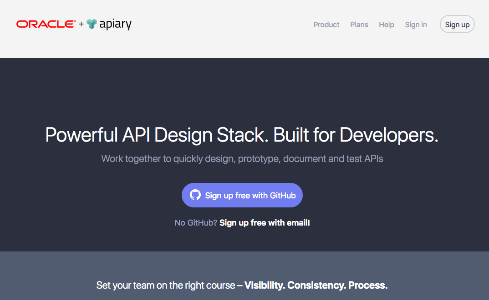

### Step 2: Sign up a free account

- If you already have an Apiary account, you can just login. If you haven't, you can sign-up for a free account with either Github OR with email. **In this example, we will sign-up with email**.

- Click [ **Sign up free with email!** ]

- Fill in your name, your email address and desired password and click [ ** Sign up for Apiary** ] - *please remember to review Apiary's Terms of Service and Privacy Policy*.

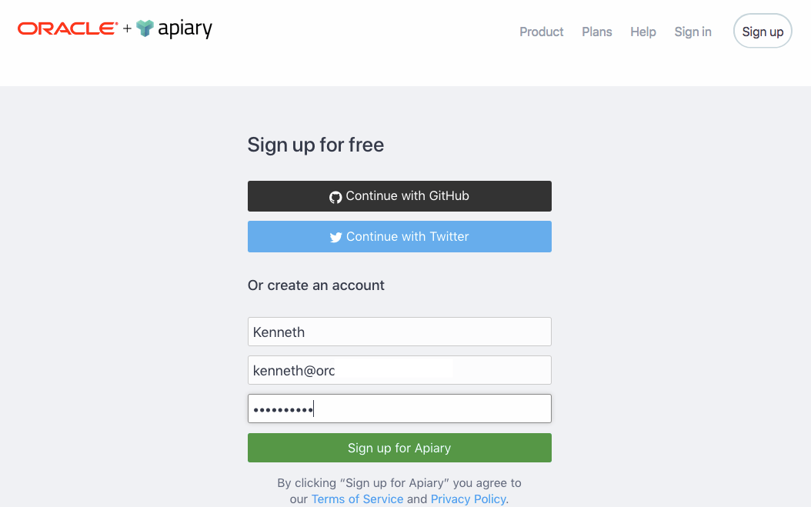

- You will receive email verification for your Apiary account. Just follow the instructions in that email to activate your free account.

### Step 3: Login to Apiary and create our first API

- If you haven't create your Apiary account, follow Step 2. Once you created your own account and got activated, you can login to Apiary.

- Login to Apiary if you haven't.
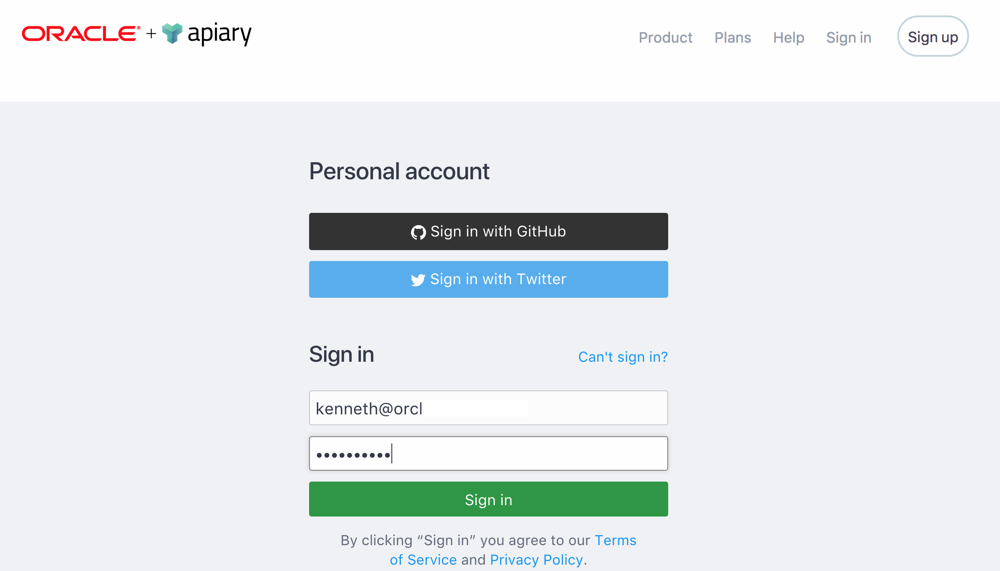

- **IF THIS IS YOUR FIRST API, YOU WILL SEE A SCREEN LIKE THIS**. Provide a name for your API, e.g. **loyalty**, **code108**, etc. Select *Start your API in* **API Blueprint** (default setting) and click [**SAVE AND START USING APIARY**]
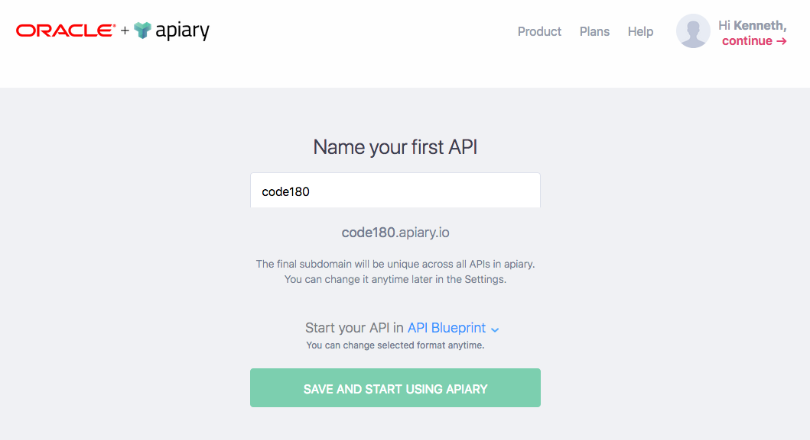

- You will be taken to the API Editor as follow
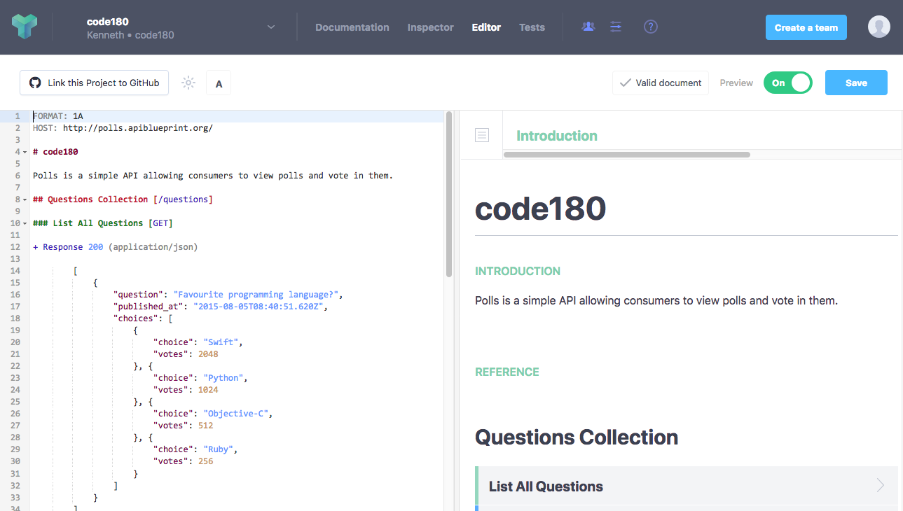


## Using Apiary Editor

### Step 4: Edit our API Blueprint

- In the API editor, replace **EVERYTHING** with the following contents - be careful, spaces/tabs and line breaks are important - please refer to the API Blueprint documentation and [tutorial](https://help.apiary.io/api_101/api_blueprint_tutorial/) for more details about how to write API Blueprint.

```
FORMAT: 1A
HOST: https://REPLACE-WITH-YOUR-ACCS-INSTANCE.oraclecloud.com

# loyalty

Loyalty is a sample coupon system

## Points [/loyalty/v2/points/{id}]

### Get the current points of member [GET]

+ Parameters
    + id: `10001` (string, required) ... member ID

+ Response 200
    + Headers

            Content-Type: application/json; charset=utf-8
    + Body

            {
                "points": 1
            }

### credit member 1 point [POST]

For every 3 points, member will get 1 coupon and point will be reset to zero. Response will be current points.

+ Parameters

    + id: `10001` (string, required) ... member ID

+ Request (application/json)

        {

        }

+ Response 200
    + Headers

            Content-Type: application/json; charset=utf-8
    + Body

            {
                "points": 2
            }

## Coupon [/loyalty/v2/coupon/{id}]

### Get the current coupon of member [GET]

+ Parameters
    + id: `10001` (string, required) ... member ID

+ Response 200
    + Headers

            Content-Type: application/json; charset=utf-8
    + Body

            {
                "coupon": 2
            }

### consume 1 coupon [POST]

+ Parameters
    + id: `10001` (string, required) ... member ID

+ Request (application/json)

        {

        }

+ Response 200
    + Headers

            Content-Type: application/json; charset=utf-8
    + Body

            {
                "coupon": 1
            }

```

- the final blueprint will looks like this
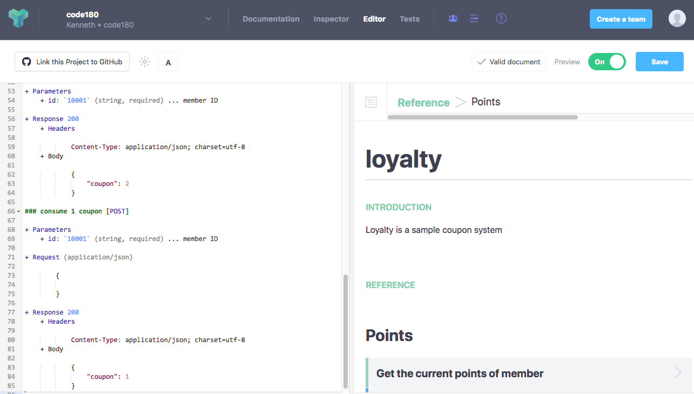


## Using Apiary Example and Console

### Step 5: Exploring API Documentation

- Once the API Blueprint is ready, we can use the Mock Server to test our API. We can also use the Mock Server for client application development & testing.

- click the [**Documentation**] tab to navigate to the API documentation. This will also be the view which *Client Application Developers* will see when they want to learn / check / test your APIs.
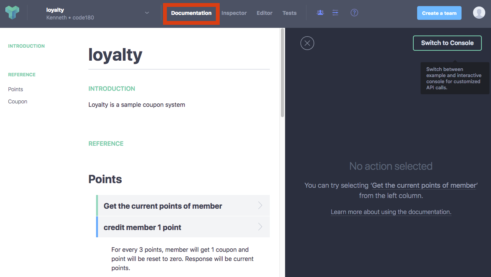

- Imagine you are the client application developer, when you navigate this page, you will know this Loyalty API contains
  - Points
    - Get current points of member
    - Credit member 1 point
  - Coupon
    - Get current number of coupons of member
    - consume 1 coupon

- Click [**Get the current points of member**] and check the right pane. It tells you example of using this API and the endpoint (URL) of the Mock Server.
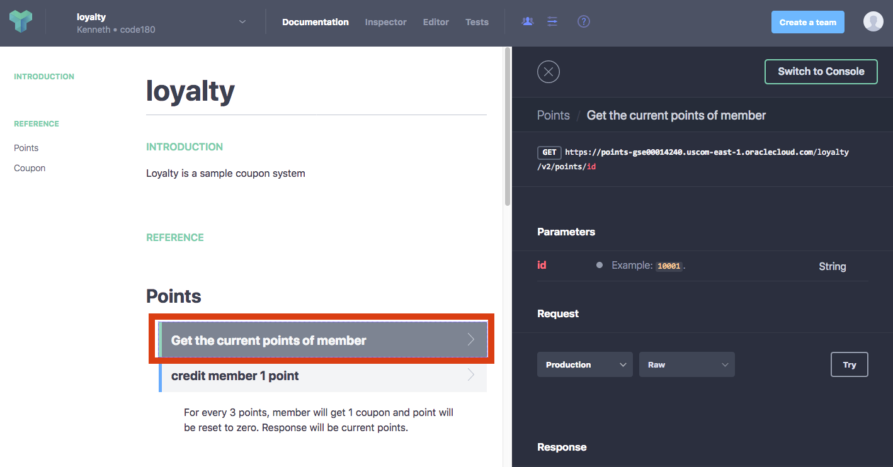    

### Step 6: Testing with Mock Server

- Let's test the API with the Mock Server. In the [**Request**] section, select [**Mock Server**] and click [**Try**] button
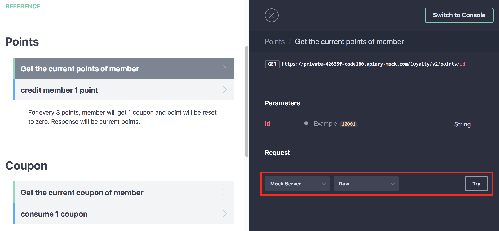

- In this test console, you can set the desired URI parametes, headers, as well as entering your payload in the request body. Just keep the default values (*we are going to get the current point of member id 10001*), check we are using the [**Mock Server**] and click [**Call Resource**] button.  
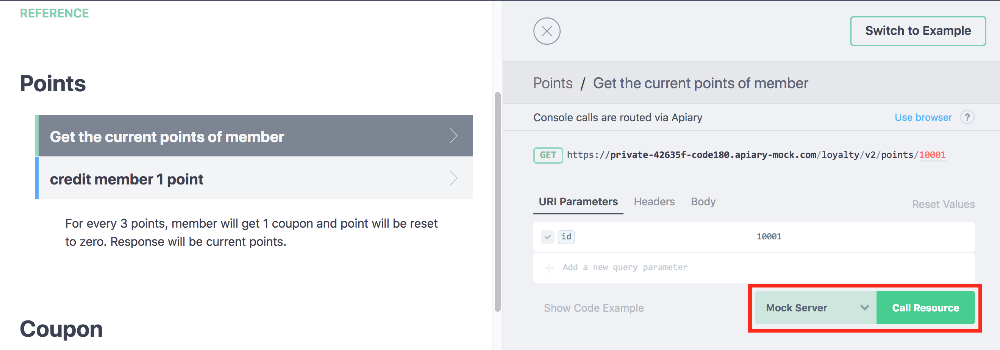

- Scroll down and you will see the API response *(from Mock Server)*. Feel free to explore the test console.
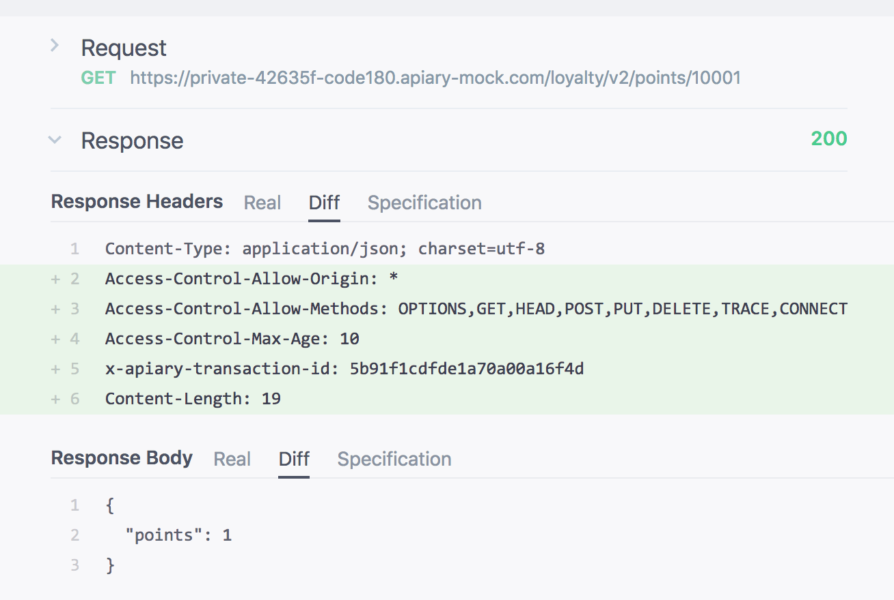

- Go back to the example console by clicking the [**Switch to Example**] *(you might need to scroll up first)*.
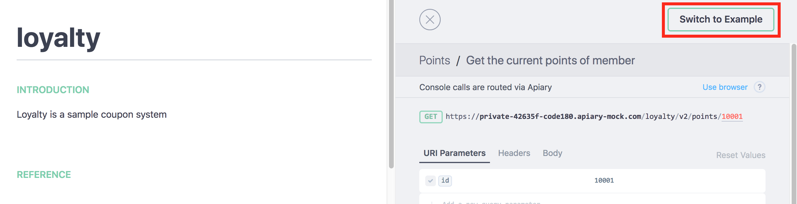


## Example Code for Client Application(s)

### Step 7: Get example code for different programming language(s)

- In the right hand pane, Request section, select your desired programming language, e.g [**JavaScript**]
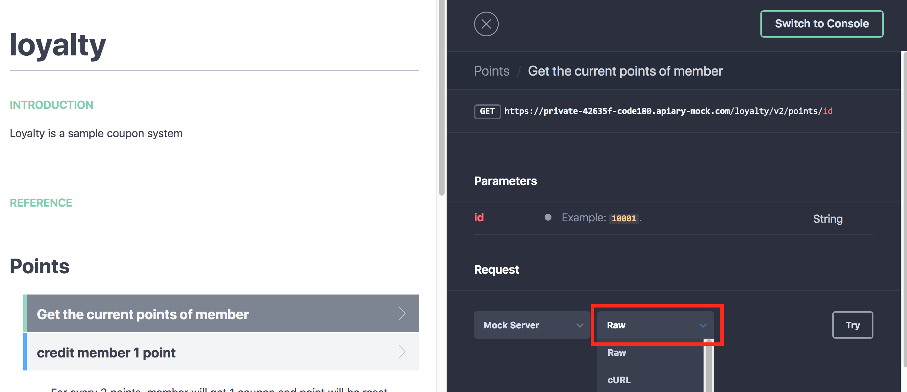

- After you change the language, the sample code will be display. As you can see, if you want to develop a HTML5 application, you can just copy and paste this sample code segment to your JavaScripts source code and change to something you need. Feel free to try different language. You can also choose *OTHER API* from *left hand pane*.
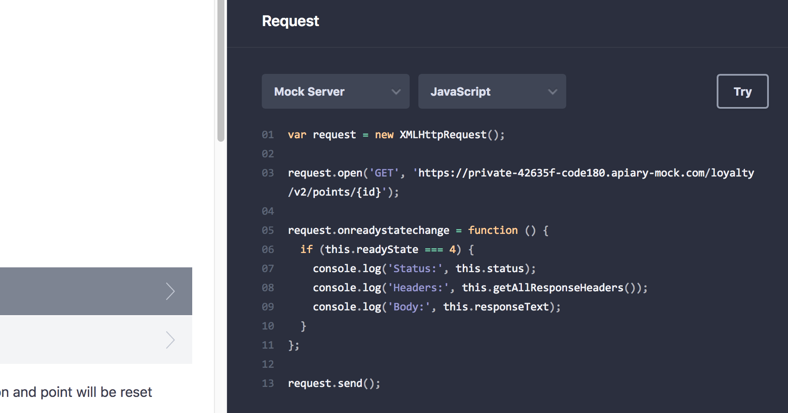

- For example if you need to develop a NodeJS client, you can use the *request* npm module and have source code similar to the following segment to interact with the API service. Of course, these are just example code. You can always use other framework (e.g. jquery, request-promise, etc) to integrate with the API service.
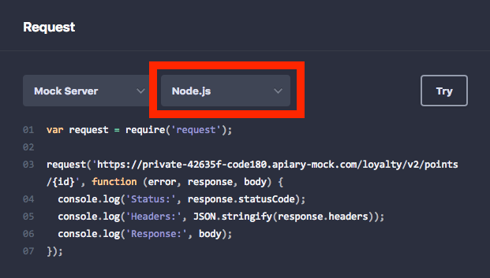

### Step 8: Apiary Mock Server

- Write down the URL of the Apiary Mock Server, we will need to use this URL in next lab.

## You've complete the Using Apiary & API Blueprint Lab.

Proceed to Next lab

Go Back to the Main Page

---
---
### Extra Screen Shot

- **IF YOU ALREADY HAVE OTHER API(s), YOU WILL SEE A SCREEN LIKE THIS**. You can choose [**Create New API Project**] in the pull-down menu and provide required information, i.e. name of API, e.g. **loyalty**. Remember to choose *Start your API in* **API Blueprint**.
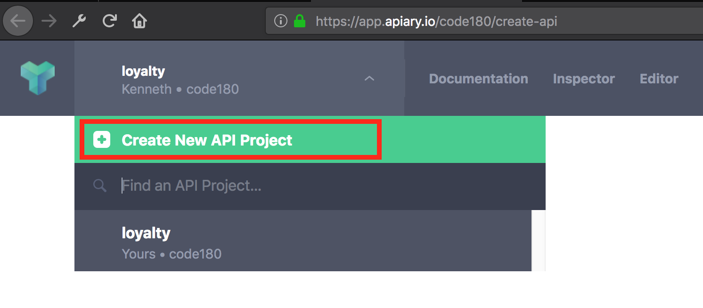
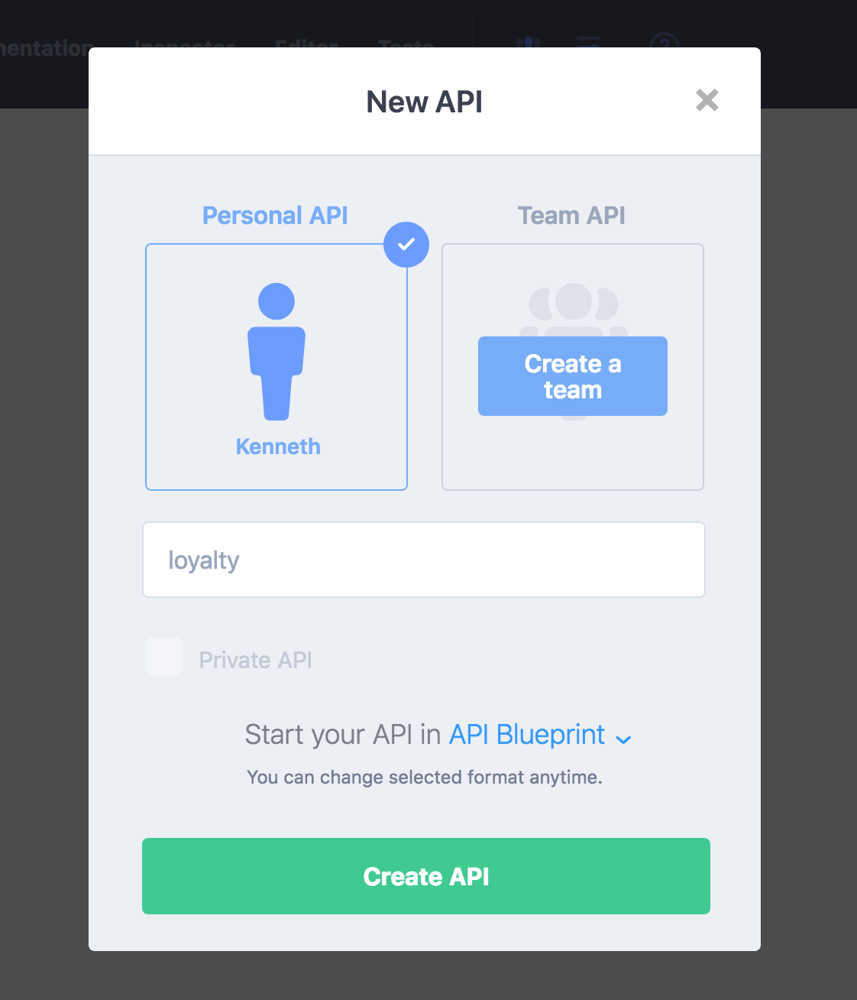
